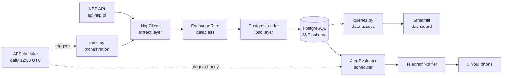

# 💱 NBPTracker

> Personal data engineering project: automated ingestion of Polish National Bank (NBP) 
> exchange rates with time-series storage, interactive dashboard, threshold-based alerts, 
> and push notifications via Telegram.

[]()
[]()
[]()
[](LICENSE)


## Why this exists

I'm planning a trip to Asia and wanted a simple way to track when key exchange rates 
(EUR, USD, CNY, JPY) hit favorable levels. I built NBPTracker to demonstrate 
end-to-end data engineering fundamentals: REST API ingestion, normalized PostgreSQL 
warehousing, scheduled orchestration, interactive visualization, and notification 
infrastructure.

## Features

- 📥 **Daily ingest** from NBP API (Table A -> 10 tracked currencies)
- 📊 **Interactive dashboard** with multi-currency chart, KPI cards, top movers
- 🔔 **Alert system** with threshold-based rules and 24h no-spam cooldown
- 📱 **Telegram push notifications** when alerts trigger
- 🐳 **Fully dockerized** -> `make up` and you're running
- ✅ **14/14 tests passing** (10 unit + 4 integration)


## Architecture




## Tech stack

| Layer | Technology |
|---|---|
| **Language** | Python 3.11 |
| **Database** | PostgreSQL 16 (3NF schema, time-series) |
| **Data ingestion** | requests + tenacity (retry/backoff) |
| **DB access** | psycopg2-binary (raw SQL, no ORM) |
| **Models** | dataclasses + Decimal (money safety) |
| **Logging** | structlog (structured JSON-ready) |
| **Dashboard** | Streamlit + Plotly Express |
| **Alerting** | Custom evaluator + Telegram Bot API |
| **Scheduling** | APScheduler (BlockingScheduler) |
| **Containers** | Docker + docker-compose (3 services) |
| **Testing** | pytest + pytest-mock |


## Quickstart

```bash
# 1. Clone
git clone https://github.com/freudianlover/nbptracker.git
cd nbptracker

# 2. Configure
cp .env.example .env
# Edit .env — set POSTGRES_PASSWORD, optionally TELEGRAM_BOT_TOKEN + CHAT_ID

# 3. Run
make up

# Dashboard at http://localhost:8501
```


## Project structure
