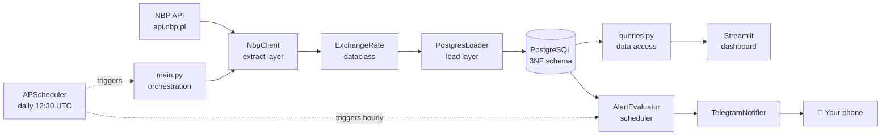
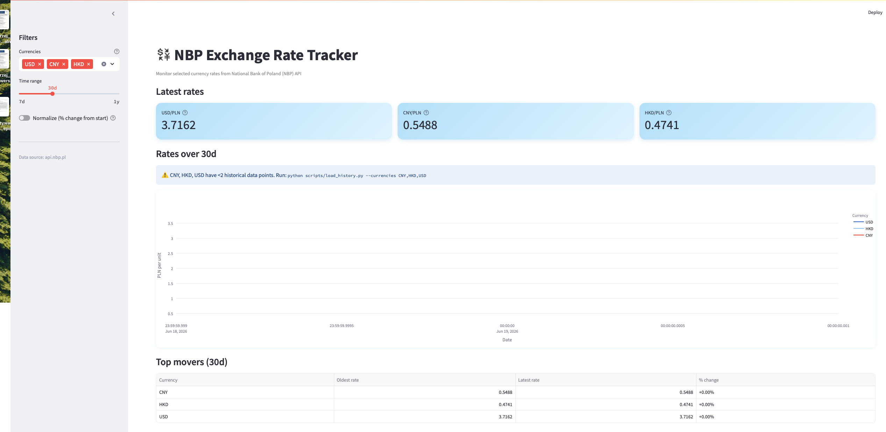
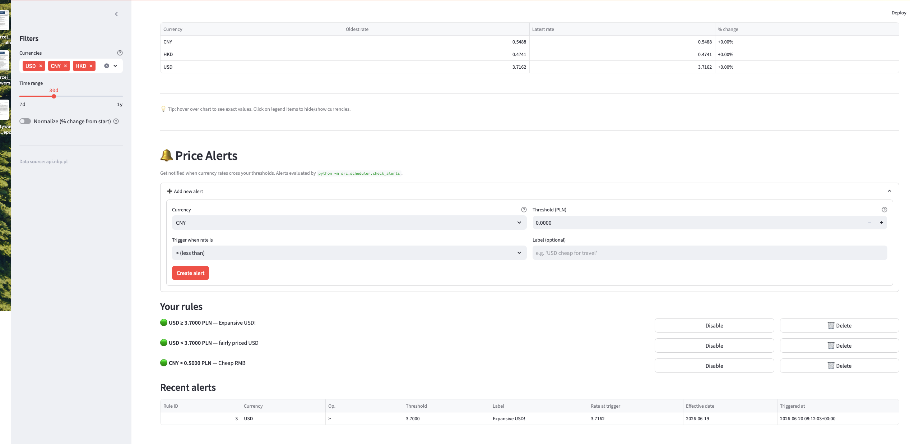
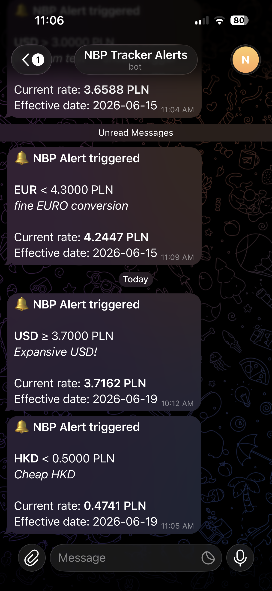

# 💱 NBPTracker

> Personal data engineering project: automated ingestion of Polish National Bank (NBP) 
> exchange rates with time-series storage, interactive dashboard, threshold-based alerts, 
> and push notifications via Telegram.

[]()
[]()
[]()
[](LICENSE)


## Why this exists

I'm planning a trip to Asia and wanted a simple way to track when key exchange rates 
(EUR, USD, CNY, JPY) hit favorable levels. I built NBPTracker to demonstrate 
end-to-end data engineering fundamentals: REST API ingestion, normalized PostgreSQL 
warehousing, scheduled orchestration, interactive visualization, and notification 
infrastructure.

## Features

- 📥 **Daily ingest** from NBP API (Table A -> 10 tracked currencies)
- 📊 **Interactive dashboard** with multi-currency chart, KPI cards, top movers
- 🔔 **Alert system** with threshold-based rules and 24h no-spam cooldown
- 📱 **Telegram push notifications** when alerts trigger
- 🐳 **Fully dockerized** -> `make up` and you're running
- ✅ **14/14 tests passing** (10 unit + 4 integration)


## Architecture




## Tech stack

| Layer | Technology |
|---|---|
| **Language** | Python 3.11 |
| **Database** | PostgreSQL 16 (3NF schema, time-series) |
| **Data ingestion** | requests + tenacity (retry/backoff) |
| **DB access** | psycopg2-binary (raw SQL, no ORM) |
| **Models** | dataclasses + Decimal (money safety) |
| **Logging** | structlog (structured JSON-ready) |
| **Dashboard** | Streamlit + Plotly Express |
| **Alerting** | Custom evaluator + Telegram Bot API |
| **Scheduling** | APScheduler (BlockingScheduler) |
| **Containers** | Docker + docker-compose (3 services) |
| **Testing** | pytest + pytest-mock |


## Quickstart

```bash
# 1. Clone
git clone https://github.com/freudianlover/nbptracker.git
cd nbptracker

# 2. Configure
cp .env.example .env
# Edit .env — set POSTGRES_PASSWORD, optionally TELEGRAM_BOT_TOKEN + CHAT_ID

# 3. Run
make up

# Dashboard at http://localhost:8501
```


## Project structure
nbptracker/

├── src/

│   ├── extract/          # NBP API client + data models

│   ├── load/             # PostgreSQL loader

│   ├── dashboard/        # Streamlit UI + queries

│   ├── scheduler/        # APScheduler runner + alert evaluator

│   ├── notifications/    # Telegram notifier

│   ├── main.py           # ETL orchestration entry point

│   └── logger.py         # structlog configuration

├── sql/

│   └── init.sql          # PostgreSQL schema (4 tables, 3NF)

├── tests/                # 14 tests: unit + integration

├── scripts/              # CLI utilities (load_history, seed_alerts, etc.)

├── docs/

│   └── screenshots/      # Dashboard screenshots

├── Dockerfile            # Multi-stage build

├── docker-compose.yml    # 3 services (postgres, scheduler, dashboard)

└── Makefile              # Developer commands

## Design decisions

### Why APScheduler instead of Airflow?

Initially I wanted to use Airflow, however that would be plain overengineering for such a simple project so I resorted to APScheduler.

### Why psycopg2 instead of SQLAlchemy?

It gave me more direct SQL control, and it seemed better for the scale of this project.

### Why Decimal for rates instead of float?

I used Decimal for rates because it is safer while working with money, it ensures that there will be no precision errors.
In financial data processing, precision is non-negotiable. This repository strictly uses Python's `decimal.Decimal` instead of native `float` for all monetary values due to the following reasons:

1. **Precision & Rounding Errors:** Python's `float` implements binary floating-point arithmetic (IEEE 754). This introduces subtle rounding errors for base-10 decimals (e.g., `0.1 + 0.2` results in `0.30000000000000004`). Across millions of transactions, these tiny discrepancies compound into significant financial data corruption.
2. **Database Integrity:** `Decimal` maps natively to SQL `NUMERIC` and `DECIMAL` data types, ensuring type safety and consistency throughout the entire ETL pipeline.
**Quick Comparison:**
```python
# float (UNSAFE for finances)
0.1 + 0.2  # Returns: 0.30000000000000004

# Decimal (SAFE for finances)
Decimal('0.1') + Decimal('0.2')  # Returns: 0.3
```

## Screenshots


*Main dashboard with multi-currency chart and KPI cards*


*Alert builder with active rules and triggered history*


*Push notification on phone when rule triggers*


## Roadmap

- [ ] **v1.0** - shipped.
- [ ] **v1.1** - to be continued!


## Author

**Karol Masiak** -> aspiring Junior Data Engineer.

- 🔗 LinkedIn: [https://www.linkedin.com/in/karol-masiak/]
- 🐙 GitHub: [@freudianlover](https://github.com/freudianlover)
- 📧 Contact: [karolmasiak@icloud.com]


## License

[MIT License](LICENSE)
